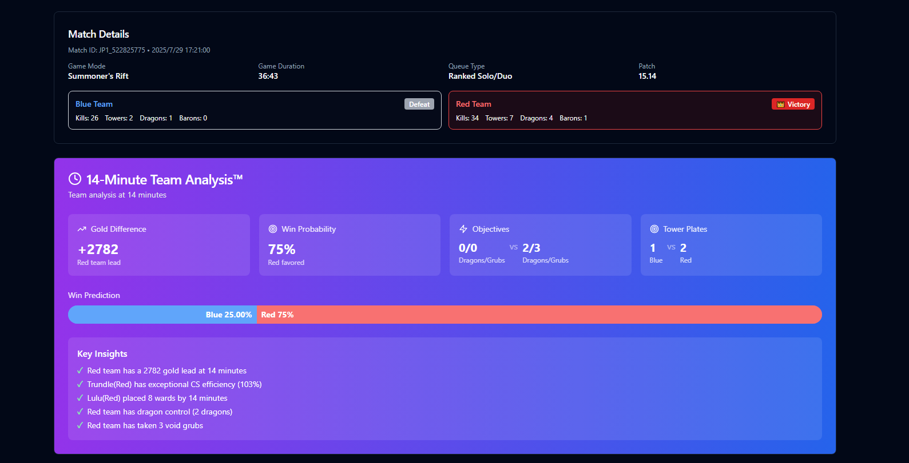
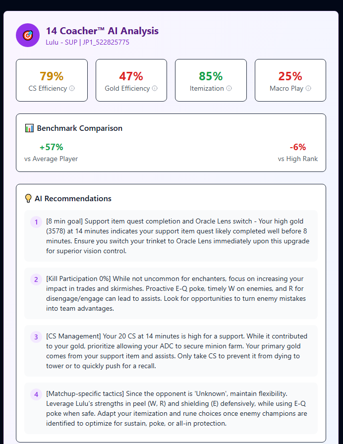
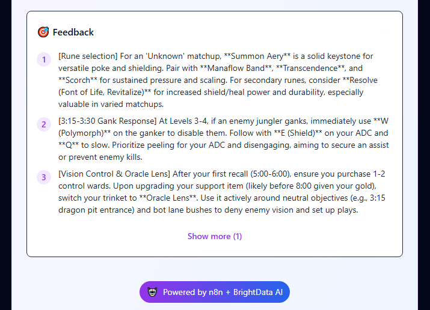

# 14Forge - LoL Performance Analytics Platform

*This is a submission for the [AI Agents Challenge powered by n8n and Bright Data](https://dev.to/challenges/brightdata-n8n-2025-08-13)*

## 🏆 Contest Entry - BrightData + n8n Contest 2025

A revolutionary League of Legends analytics platform featuring unique **14-Minute Analysis™** technology, powered by n8n AI Agents and BrightData web scraping.

## 🎯 What Makes 14Forge Unique?

### 14-Minute Analysis™
Based on statistical analysis of thousands of games, the 14-minute mark is identified as a critical inflection point in League of Legends matches. Our platform provides:
- **Win probability prediction** based on 14-minute game state
- **Performance benchmarking** against high-rank players
- **AI-powered coaching** with personalized recommendations

### Key Features
- 🤖 **AI Coaching (14 Coacher)**: Gemini-powered analysis with multi-language support (EN/JP/KR)
- 📊 **14-Minute Analysis**: Performance analysis based on 14-minute game state, win rate prediction, and comparison with high-tier players
- 📊 **Multi-Source Meta Analysis**: Aggregates data from various statistics sources

## 📸 Screenshots

### Match Details


### 14-Minute Analysis


### AI Coaching



## 🚀 Quick Start

### Prerequisites
- Node.js 18+
- Docker & Docker Compose
- PostgreSQL 15
- n8n (self-hosted or cloud)
- API Keys:
  - Riot Games API Key
  - BrightData Account
  - Gemini API Key

### Installation

1. **Clone the repository**
```bash
git clone https://github.com/goodaymmm/14Forge.git
cd 14Forge
```

2. **Set up environment variables**
```bash
cp .env.example .env
# Edit .env with your API keys
```

3. **Start PostgreSQL with Docker**
```bash
cd backend
docker-compose up -d postgres
```

4. **Run database migrations**
```bash
cd backend/api
npm install
npm run db:migrate
```

5. **Start the backend server**
```bash
cd backend/api
npm run dev
# Server runs on http://localhost:3000
```

6. **Start the frontend**
```bash
cd frontend
npm install
npm run dev
# Frontend runs on http://localhost:5173
```

7. **Set up n8n workflows**
```bash
# Start n8n
docker-compose up -d n8n
# Access n8n at http://localhost:5678
# Import workflows from n8n_workflows/ directory
```

## 🔧 Configuration

### Environment Variables

Create a `.env` file based on `.env.example`:

```env
# Riot API (Get from https://developer.riotgames.com)
RIOT_API_KEY=RGAPI-xxxxxxxx-xxxx-xxxx-xxxx-xxxxxxxxxxxx

# Database
DB_HOST=localhost
DB_PORT=5432
DB_NAME=lol_stats
DB_USER=postgres
DB_PASSWORD=postgres

# BrightData
BRIGHTDATA_USERNAME=brd-customer-xxxxxxxx
BRIGHTDATA_PASSWORD=xxxxxxxx
BRIGHTDATA_ZONE=lol_stats_unlocker

# n8n
N8N_WEBHOOK_URL=http://localhost:5678
```

### n8n Workflow Setup

1. Access n8n UI at `http://localhost:5678`
2. Import the following workflows from `n8n_workflows/`:
   - `14coacher.json` - Main AI coaching workflow
   - `data-dragon-sync` - Collects and stores champion and item data from Riot official API
   - `Build-Blitz-Collector.json` - Meta data collection (⚠️ Takes ~2 hours per run)
   - `Match-Statistics-Collector.json` - Match statistics aggregation (⚠️ Takes ~2 hours per run)

**⚠️ Important Note**: The knowledge base workflows (`Build-Blitz-Collector` and `Match-Statistics-Collector`) process massive amounts of dynamic content and can take up to 2 hours to complete. By default, they run periodically (daily) to keep meta data current.

## 🏗️ Architecture

### Tech Stack
- **Frontend**: React 18, TypeScript, Vite, TanStack Query, Tailwind CSS
- **Backend**: Express.js, TypeScript, PostgreSQL 15, Winston
- **Integration**: n8n (workflow automation), BrightData (web scraping)
- **AI**: Google Gemini 2.5 Flash
- **Infrastructure**: Docker, Docker Compose

### 14 Coacher Data Flow
```
User Request → Frontend → Backend API → n8n Webhook
                                           ↓
                                    Cache Check
                                           ↓
                        BrightData Scraping (Meta Collection)
                                           ↓
                                     AI Analysis
                                           ↓
                                  PostgreSQL Storage
                                           ↓
                                  Response to User
```

## 📊 n8n Workflows

### 14 Coacher Workflow
The main AI coaching workflow operates as follows:
1. Receives match data via webhook
2. Collects meta information using BrightData (player rating and server-specific data)
3. Retrieves global statistics from database
4. Transforms data into prompts and analyzes performance with Gemini
5. Returns personalized coaching recommendations
※ If cache exists in PostgreSQL, it returns that information for fast response.

### Meta Collection Workflows
- **Build-Blitz-Collector**: Scrapes champion builds from Blitz.gg
- **Match-Statistics-Collector**: Aggregates match statistics across regions

## 🧪 Testing

### Test n8n Webhook
```bash
# Windows
test-webhook.cmd

# Linux/Mac
./test-webhook.sh
```

## 📄 License

This project is licensed under the MIT License

## 🙏 Acknowledgments

- **Riot Games** for providing the comprehensive API
- **BrightData** for powerful web scraping capabilities
- **n8n** for the amazing workflow automation platform
- **Contest Organizers** for this opportunity